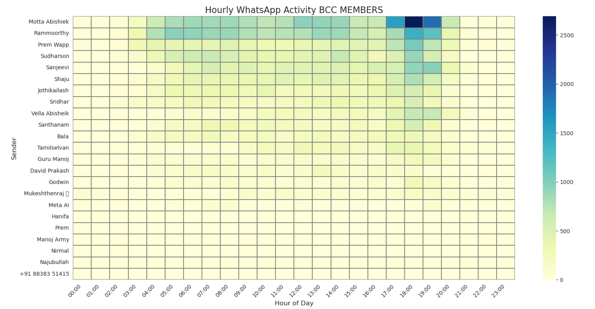

# WhatsApp Chat Analysis  📱🧠


This project analyzes WhatsApp group chat data from 2021–2025 for a private group.  
It includes visualizations, time-based trends, and behavioral summaries for each participant.

## 📁 Project Structure

```
.
├── data/
│   └── WhatsApp Chat.txt
├── images/
│   ├── message_distribution.png
│   └── hourly_activity_heatmap.png
├── scripts/
│   ├── message_distribution.py
│   └── hourly_activity_heatmap.py
└── README.md
├── LICENSE
└── requirements.txt
```

## 📊 Features

- 📦 **Message breakdown by type**: Text, Media, Stickers/Emojis, Audio, Video, Reactions
- 🕒 **Hourly activity heatmap** per user
- 💬 **Top used words** per person
- 🧠 **Psychological and character profiling** based on chat tone and behavior
- 📈 Beautiful plots using `matplotlib` and `seaborn`

---

## 🚀 How to Run

### 1. Install dependencies

```bash
pip install matplotlib seaborn
```

### 2. Run the scripts

```bash
python scripts/message_distribution.py
python scripts/hourly_activity_heatmap.py
```

---
📸 Sample Visuals
**Message Distribution**  


**Hourly Activity Heatmap**  


---

👨‍💻 Author
Mukesh Thenraj

📄 License
This project is open for educational and non-commercial use.
